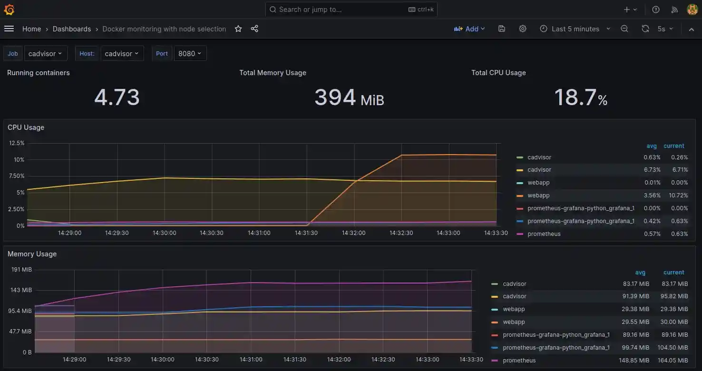

# Flask API Monitoring

## Using Prometheus and Grafana to Monitor ML Prediction API Endpoints

Run the Python Alpine container housing a simple Flask APP and the Prometheus / Grafana container monitoring the application HTTP endpoint:


```bash
docker-compose up -d --build
```

| IMAGE | COMMAND | PORTS | NAMES |
| -- | -- | -- | -- |
| grafana/grafana | "/run.sh" | 0.0.0.0:3000->3000/tcp, :::3000->3000/tcp | prometheus-grafana-python_grafana_1 |
| prom/prometheus | "/bin/prometheus --c…" | 0.0.0.0:9090->9090/tcp, :::9090->9090/tcp | prometheus |
| prometheus-grafana-python_webapp | "/bin/sh -c 'gunicor…" | 0.0.0.0:5000->5000/tcp, :::5000->5000/tcp | webapp |
| gcr.io/cadvisor/cadvisor | "/usr/bin/cadvisor -…" | 0.0.0.0:8080->8080/tcp, :::8080->8080/tcp | cadvisor |


### Webapp

You can check the Flask app frontend on port 5000 - it should return the string `home`:


```bash
curl http://localhost:5000/
home
```

While the `/metrics` endpoint returns API metrics using [Prometheus Client WSGI Middleware](https://pypi.org/project/prometheus-client/):

```bash
curl http://localhost:5000/metrics
# HELP python_gc_objects_collected_total Objects collected during gc
# TYPE python_gc_objects_collected_total counter
python_gc_objects_collected_total{generation="0"} 1088.0
python_gc_objects_collected_total{generation="1"} 411.0
python_gc_objects_collected_total{generation="2"} 0.0
# HELP python_gc_objects_uncollectable_total Uncollectable object found during GC
# TYPE python_gc_objects_uncollectable_total counter
python_gc_objects_uncollectable_total{generation="0"} 0.0
python_gc_objects_uncollectable_total{generation="1"} 0.0
python_gc_objects_uncollectable_total{generation="2"} 0.0
# HELP python_gc_collections_total Number of times this generation was collected
# TYPE python_gc_collections_total counter
python_gc_collections_total{generation="0"} 82.0
python_gc_collections_total{generation="1"} 7.0
python_gc_collections_total{generation="2"} 0.0
# HELP python_info Python platform information
# TYPE python_info gauge
python_info{implementation="CPython",major="3",minor="9",patchlevel="18",version="3.9.18"} 1.0
# HELP process_virtual_memory_bytes Virtual memory size in bytes.
# TYPE process_virtual_memory_bytes gauge
process_virtual_memory_bytes 3.4152448e+07
# HELP process_resident_memory_bytes Resident memory size in bytes.
# TYPE process_resident_memory_bytes gauge
process_resident_memory_bytes 2.8905472e+07
# HELP process_start_time_seconds Start time of the process since unix epoch in seconds.
# TYPE process_start_time_seconds gauge
process_start_time_seconds 1.69736448312e+09
# HELP process_cpu_seconds_total Total user and system CPU time spent in seconds.
# TYPE process_cpu_seconds_total counter
process_cpu_seconds_total 0.32
# HELP process_open_fds Number of open file descriptors.
# TYPE process_open_fds gauge
process_open_fds 11.0
# HELP process_max_fds Maximum number of open file descriptors.
# TYPE process_max_fds gauge
process_max_fds 1.073741816e+09
```


### Prometheus

The Prometheus dashboard can be reached on `http://localhost:9090/`. Check out `app/helpers/middleware.py` for the created __Counter__ `http_request_count` and __Histogram__ `http_request_latency_seconds` that can be accessed from the dashboard:


### Grafana

Visit the Grafana dashboard on `localhost:3000` and login with `admin` and the value for `GF_SECURITY_ADMIN_PASSWORD` set in `./docker-compose.yml` - the default is `foobar`.


Now go to __Home > Connections > Data sources__ and add an instance of __Prometheus__. Use the `prometheus` container name used in `./docker-compose.yml` to connect your locally running instance:


You can now import a new dashboard for the Prometheus service from the provided JSON file `./config/grafana/flask_service_dashboard.json`:


#### cAdvisor

* [google / cadvisor](https://github.com/google/cadvisor)

cAdvisor (Container Advisor) provides container users an understanding of the resource usage and performance characteristics of their running containers. It is a running daemon that collects, aggregates, processes, and exports information about running containers. Specifically, for each container it keeps resource isolation parameters, historical resource usage, histograms of complete historical resource usage and network statistics. This data is exported by container and machine-wide.


Import a new dashboard for the cAdvisor service from the provided JSON file `./config/grafana/cadvisor_dashboard.json`.  And visit the following endpoints to simulate a CPU and memory intensive application running:


* `http://localhost:5000/cpu`
* `http://localhost:5000/memory`


